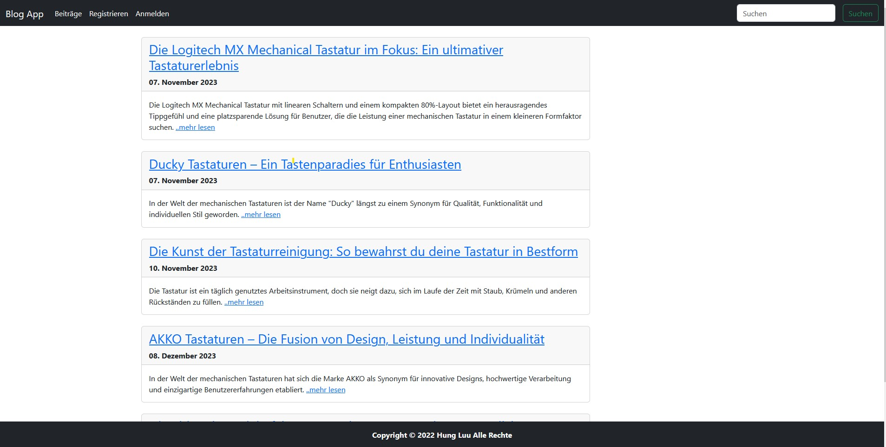
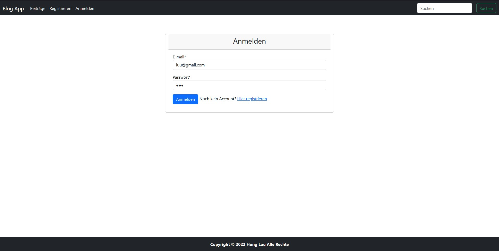
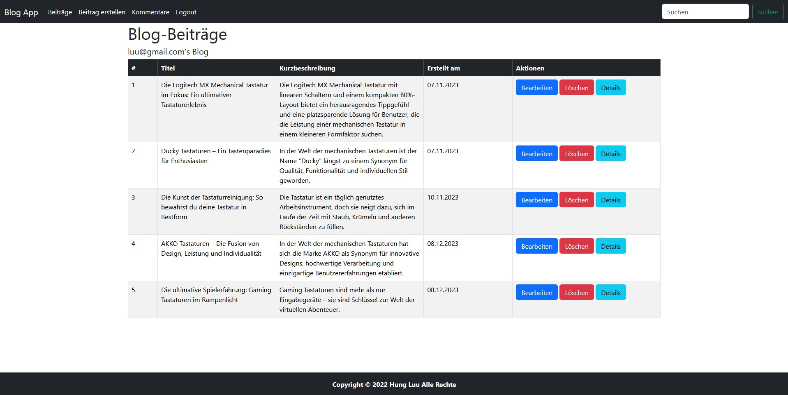
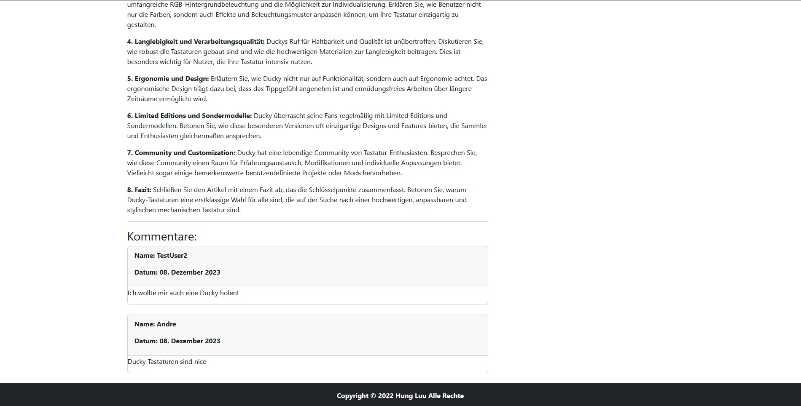
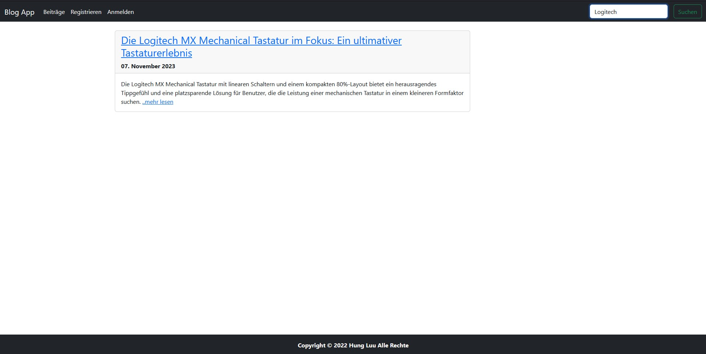

# Web Blog App

Die Web Blog App ist eine Anwendung, die mit Spring Boot, Java, MySQL und Thymeleaf entwickelt wurde. Sie verwendet Java 17 und Gradle als Build-Tool. Die Anwendung nutzt Spring JPA für die Datenbankinteraktion und Spring Security für die Authentifizierung und Autorisierung.
Bei meinem Beispiel habe ich Blog Einträge über Tastaturen gemacht, weil ich mich auch für Tastaturen interessiere.

## Funktionen

- **Benutzerrollen:**
    - **User:** Können ihre eigenen Blog-Einträge erstellen, bearbeiten und löschen, sowie Kommentare hinzufügen. Sie haben Zugriff auf ihre eigenen Beiträge und Kommentare.
    - **Admin:** Kann alle Beiträge und Kommentare sehen, bearbeiten und löschen. Hat Zugriff auf alle Funktionen der Anwendung.

- **Suchfunktion:**
    - Benutzer können nach Beiträgen suchen, um schnell relevante Inhalte zu finden.

- **Zugriff ohne Anmeldung:**
    - Beiträge können auch ohne Anmeldung eingesehen werden.

## Technologiestack

- **Backend:**
    - Spring Boot
    - Java 17
    - Gradle

- **Datenbank:**
    - MySQL
    - Spring JPA für die Datenbankinteraktion

- **Frontend:**
    - Thymeleaf für die Template-Engine

- **Sicherheit:**
    - Spring Security für die Authentifizierung und Autorisierung

## Anwendungsberechtigungen

- **User:**
    - Eigene Blog-Einträge erstellen, bearbeiten und löschen
    - Kommentare zu Beiträgen hinzufügen
    - Zugriff auf eigene Beiträge und Kommentare

- **Admin:**
    - Alle Beiträge und Kommentare sehen, bearbeiten und löschen
    - Vollständiger Zugriff auf alle Funktionen der Anwendung

## Nutzung

Um die Anwendung lokal auszuführen, führe die folgenden Schritte aus:

1. Klone das Repository:
   ```bash
   git clone https://github.com/DeinBenutzername/DeinRepository.git

2. Passe die Konfiguration in der application.properties an, insbesondere die MySQL-Verbindungsinformationen.

3. Führe die Anwendung aus:
    ```bash
    ./gradlew bootRun

Greife über deinen Webbrowser auf die Anwendung zu: http://localhost:8080

### Anmelden

### Admin

### Kommentare

### Suchfunktion
